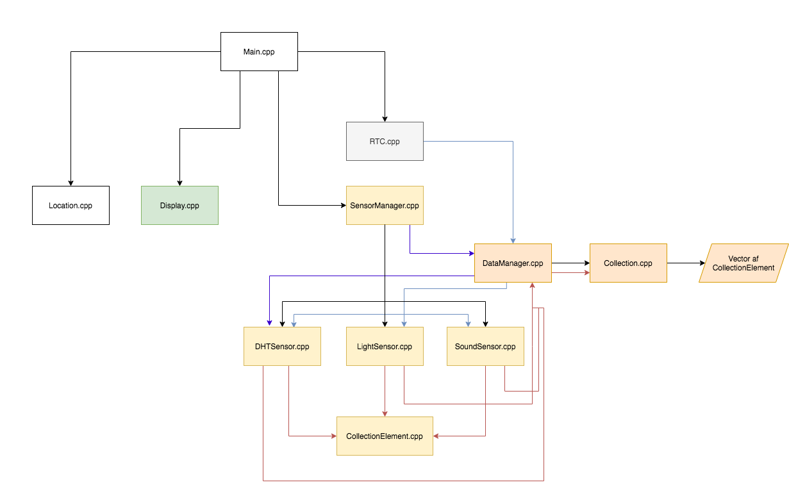
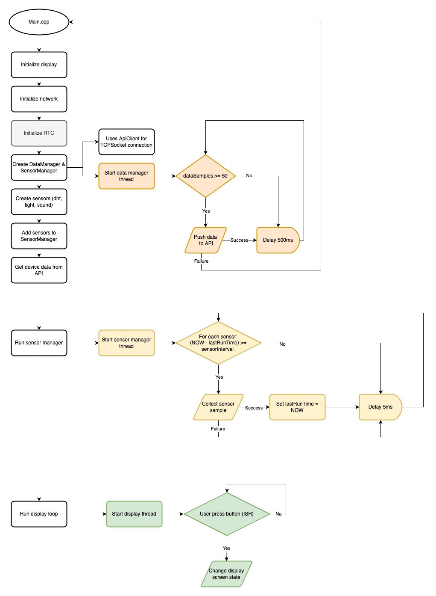

# Documentation

Forfatter: Rasmus Bundsgaard Sørensen

Dato: 20/08/2020

Kort beskrivelse: Dette program er til indendørs kontor-miljø-overvågning. Programmet fokuserer primært at sende data op til et API og ind i en database, da det er lettere at behandle og gemme data her, samt det vil kunne tilgås overalt i verden.

---
**OBS Nogle ting er ikke færdige!!**

WIP = Work In Progress

---

## 1. Beskrivelse af case:

Jeg valgte denne case fordi jeg tænkte man kunne lave nogle meget fede ting med det. Programmet er sat op mod et API jeg har lavet som indsætter alt (eller det meste) af sensor dataen. Her har jeg lavet et lille interface på [en hjemmeside](http://ec2-api.rasmusbundsgaard.dk/) til at se data fra sensorene.

Min tanke var at holde mig forholdsvis meget til casen, men der er nogle punkter som jeg er sprunget over - fx. det med at arbejde med en servo eller stepper motor. Grunden til det var at:
    - Tiden var knap (har lavet mange andre ting)
    - Så det ikke som en "kæmpe" udfordring
    - Det virkede lidt underligt ift. resten af casen (altså at jeg nærmest kun sender sensor data) (det virkede "søgt")

Jeg har heller ikke nået at lave indtasting af lokation for enheden, men min tanke var at det enten skulle gøres på displayet via et simpelt keyboard eller den kunne hente denne data ned fra API'et (skulle være koblet op på et DEVICE_ID) - på den måde vil det også være gemt hvis devicet restartes.

Lidt om det biblioteker der er brugt:
    - `mbed-dht` - Det er bibliotek kopieret fra mbed's egen side, men lavet om fra `int` til `float` så der kan opnås decimal temperaturer/luftfugtighed
    - `mbed-http-client` Det er også et bibliotek fra mbed's egen side, men da det var lavet til Mbed OS 5 skulle jeg lave lidt om i det (fx. bruge `SocketAddress`) det burde virke nu.
    - `mbed-rtc` Er en overbygning til Mbeds `ntp-client`. Det er meningen at RTC bare sættes helt automatisk og udover det så er det normale `time(NULL)` kun timestamps hvert sekund. Jeg har lavet det så man også kan få millisekunds-timestamp vha. en `Ticker`.

### Diagram over classes og threads:

* Kasser med samme farve er på samme tråd
* Pilenes retning: Hvordan klasserne bruges igennem hinanden.
* Pilenes farve: Hvordan et objekt bliver ført rundt i systemet

### Diagram over virkemåde (flowchart)

## 2. Map over sensorer / PINOUT

- LCD/Touch screen:
   - Den er indbygget
- Grove LED:
   - D2
- Grove DHT Pro:
   - D4
- Grove Buzzer:
   - D5
- Grove Button:
   - D6
- Grove Sound Sensor:
   - A0
- Grove Light Sensor:
   - A1

# 3. Seriel kommunikation

Jeg bruger `printf()` til at kommunikere serielt. Jeg bruger Mbed studio and CLI-versionen til dette. CLI-kommando: `mbed sterm -b 115200`

## 4. Features

Der er flere forskellige "områder" programmet gør sig i:
1) LCD Display 
2) Sensor data opsamling 
3) API tilslutning
4) Real-Time-Clock

- Boot skærm 
- Display med forskellige "states":
    - Hjemmeskærm
    - Lokations-skærm
    - Seneste data (WIP) - viser de seneste data samt nuværende tidspunkt
    - Notifikation (WIP) - skal vise en notifikation fx. hvis det er for varmt i rummet. Her skal også blinkes med en LED.
- Alarm (WIP) - Start buzzeren hvis lydniveauet er højt over en længere periode om aftenen/natten 

## 5. Notifikationer (WIP)

Notifikation skal vises med passelig besked på skærmen, når:

- `sound > sound_threshold`
- `temperature > temperature_threshold`
- `humididity > humidity_threshold`

## 6. Væsentlige ændringer

Først havde jeg en del tråde - jeg havde en tråd for hvert `DataManager` objekt samt en tråd for hver enkelt sensor. Altså bare sensor opsamlingen vil være 6 tråde (3*2) samtidig med det er er display tråden og en tråd for RTC og selvfølgelig main tråden. Det gjorde jeg ofte kom ud o `operator new out of memory` fejlen. Jeg fixede det, så alt data opsamling foregår på 1 tråd i stedet for 3 og 1 tråd for API-delen. Dette kan gøres med tidsintervaller og tidstempler for at undgå at blokere tråden. 

## 7. Problemer

- Jeg vil gerne lave ednnu bedre memory performance for nogle gange crasher det stadigvæk. Dog tror jeg måske det "bare" har været under testing hvor jeg opsamler data meget ofte. Jeg har fundet frem til det har noget at gøre med HTTP request/response.
- Problemer med at loop'e en `vector` med forskellige classes som implementere det samme interface / nedarver samme base class (**løst**)

## 8. Fremtidige ændringer

- Jeg vil gerne lave det så programmet kan kører "uendeligt", så det ikke crasher - eller hvis det gør at den kan genstarte selv. Kan også være trådene skal have defineret deres memory
- Se sensor data på LCD display'et
- Lave notifikations-systemet
- Alarm system
- Brugeren kan ændre lokation via. display + gemme det i API'et, samt hente det ved opstart.
