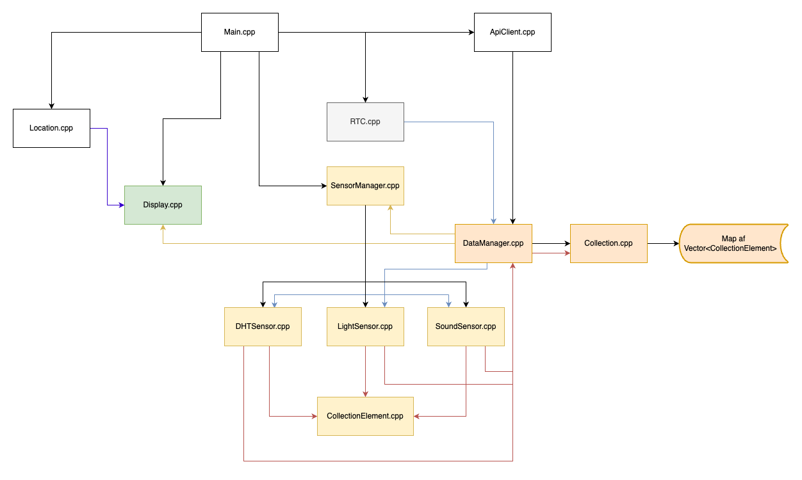

# Documentation

Projekt navn: Office Monitor

Forfatter: Rasmus Bundsgaard Sørensen

Dato: 13/09/2022

Kort beskrivelse: Dette program er til indendørs kontor-miljø-overvågning. Programmet fokuserer primært at sende data op til et API og ind i en database, da det er lettere at behandle og gemme data her, samt det vil kunne tilgås overalt i verden.

Logbog (trello): [https://trello.com/b/pqonOZBQ/ec3-logbog](https://trello.com/b/pqonOZBQ/ec3-logbog)

---
**OBS Nogle ting er ikke færdige!!**

WIP = Work In Progress

---

## 1. Beskrivelse af case:

Jeg valgte denne case fordi jeg tænkte man kunne lave nogle meget fede ting med det og det kan også let udbygges. Programmet er sat op mod et API jeg har lavet, som indsætter alt (eller det meste) af sensor dataen. Her har jeg lavet et lille interface på [en hjemmeside](http://ec3-api.rasmusbundsgaard.dk/) til at se data fra sensorerne.

Via API'et henter enheden sin lokation og enhedsnavn, som vises på displayet. Det betyder også lokationen dynamisk kan ændres via API'ets REST endpoints. Der er også lavet sådan at enheden er "forbundet" til nogle sensorer i backenden. Det betyder det er muligt at enable/disable udvalgte sensore fra enheden dynamisk via API'et!

Lidt om det biblioteker der er brugt:
    - `mbed-dht` - Det er bibliotek kopieret fra mbed's egen side, men lavet om fra `int` til `float` så der kan opnås decimal temperaturer/luftfugtighed. Udover det har jeg også opdateret koden til at fungerer med Mbed OS 6.
    - `mbed-http-client` Det er også et bibliotek fra mbed's egen side, men da det var lavet til Mbed OS 5 skulle jeg lave lidt om i det (fx. bruge `SocketAddress`) det burde virke nu til Mbed OS 6.
    - `mbed-rtc` Er en overbygning til Mbeds `ntp-client`. Det er meningen at RTC bare sættes helt automatisk og udover det så er det normale `time(NULL)` kun timestamps hvert sekund. Jeg har lavet det så man også kan få millisekunds-timestamp vha. en `Ticker`.

### Diagram over classes og threads:

* Kasser med samme farve er på samme tråd
* Pilenes retning: Hvordan klasserne bruges igennem hinanden.
* Pilenes farve: Hvordan et objekt bliver ført rundt i systemet

### Diagram over virkemåde (flowchart)

## 2. Map over sensorer / PINOUT

- LCD/Touch screen:
   - Den er indbygget
- Grove DHT Pro:
   - D4
- Grove Buzzer:
   - D5
- Grove Button:
   - D6
- Grove Sound Sensor:
   - A0
- Grove Light Sensor:
   - A1

# 3. Seriel kommunikation

Jeg bruger `printf()` til at kommunikere serielt. Det er vigtigt at sætte Baud rate til 115200. Jeg bruger Mbed studio and CLI-versionen til dette. CLI-kommando: `mbed sterm -b 115200`.

## 4. Features

Der er flere forskellige "områder" programmet gør sig i:
1) LCD Display
2) Sensor data opsamling
3) API tilslutning
4) Real-Time-Clock

- Boot skærm
- Display med forskellige "states":
    - Hjemmeskærm
    - Lokations-skærm
    - Seneste data - viser de seneste data samt nuværende tidspunkt
    - Notifikation (WIP) - skal vise en notifikation fx. hvis det er for varmt i rummet. Her skal også blinkes med en LED.
- Alarm (WIP) - Start buzzeren hvis lydniveauet er højt over en længere periode om aftenen/natten

## 5. Sikkerhed

### TLS
For at sikre data og sikker kommunikation mellem serveren og klienten bør der opsættes et SSL/TLS-certifikat på serveren som sikre API'et (hjemmesiden) - altså "HTTP over TLS" også kaldet HTTPS. Dette vil sikre at andre ikke kan hverken se eller ændre på data som sendes mellem klient og server (Man-In-The-Middle Attack er _ikke_ muligt)

Yderligere sikkerhed vil være at sikre API'et mod klienter som ikke har adgang. Hvis ikke der laves en form for authentication system, vil det være muligt for enhver i verden at kalde alle endpoints i API'et og dermed ændre på data i databasen, eller læse alle data. Dette kan sikres via fx. Tokens. Jeg har valgt at implementere det som en hardcoded token på enheden som giver adgang til alle endpoints. Dette er ikke det mest sikre, token ikke udløber, hvilket et god practice at lave en ny token - fx. hver uge. Dette kræver dog en del mere arbejde og tid som jeg ikke lige har.

## 6. Notifikationer (WIP)

Notifikation skal vises med passelig besked på skærmen, når:

- `sound > sound_threshold`
- `temperature > temperature_threshold`
- `humididity > humidity_threshold`

## 7. Væsentlige ændringer

Først havde jeg en del tråde - jeg havde en tråd for hvert `DataManager` objekt samt en tråd for hver enkelt sensor. Altså bare sensor opsamlingen vil være 6 tråde (3*2) samtidig med det er er display tråden og en tråd for RTC og selvfølgelig main tråden. Det gjorde jeg ofte kom ud o `operator new out of memory` fejlen. Jeg fixede det, så alt data opsamling foregår på 1 tråd i stedet for 3 og 1 tråd for API-delen. Dette kan gøres med tidsintervaller og tidstempler for at undgå at blokere tråden.

Ændret `Collection` fra at bruge en `std::vector` til en `std::map`. Dette gjorde det noget nemmere at arbejde med de forskellige typer af opsamlingsdata seperat.

## 8. Problemer

- Jeg vil gerne lave ednnu bedre memory performance for nogle gange crasher det stadigvæk. Dog tror jeg måske det "bare" har været under testing hvor jeg opsamler data meget ofte. Jeg har fundet frem til det har noget at gøre med HTTP request/response.
- Sætte HTTPS på en IP/lokal domæne (.local) er ikke muligt. Det skal være en public-facing domæne med et "godkendt" TLD.
- Problemer med at loop'e en `vector` med forskellige classes som implementere det samme interface / nedarver samme base class (**løst**)
- Display'et kan ikke helt finde ud af at Clear linjen rigtigt hvis den forrige string er større længde en den nye (**løst (padded strings)**)
- Problemer med at parse JSON response fra API'et. Det skal gerne være et lille library, men de fleste jeg fandt til Mbed virkede ikke korrekt. Endte med at finde et lille library som virkede, men originalt er tiltænkt Arduino. Det virker dog fint med STM boardet. (**løst**)

## 8. Fremtidige ændringer

- Tjekke om der er memory leaks - heg vil gerne lave det så programmet kan køre "uendeligt", så det ikke crasher - eller hvis det gør at den kan genstarte selv. Kan også være trådene skal have defineret deres memory (**Har kørt en dag uden stop, så dette er muligvis blevet fikset**)
- Lave notifikations-systemet
- Alarmsystem
- Ændre display-tiden til at have den korrekte tidszone, som evt. kunne hentes fra API'et.
- Afkoble display-sensor-data fra den data-collection som sendes til API'et, da den cleares og dermed er skærmen tom for data.
